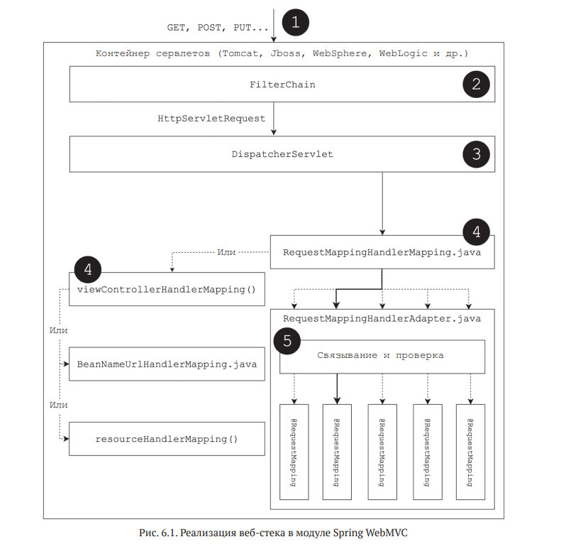
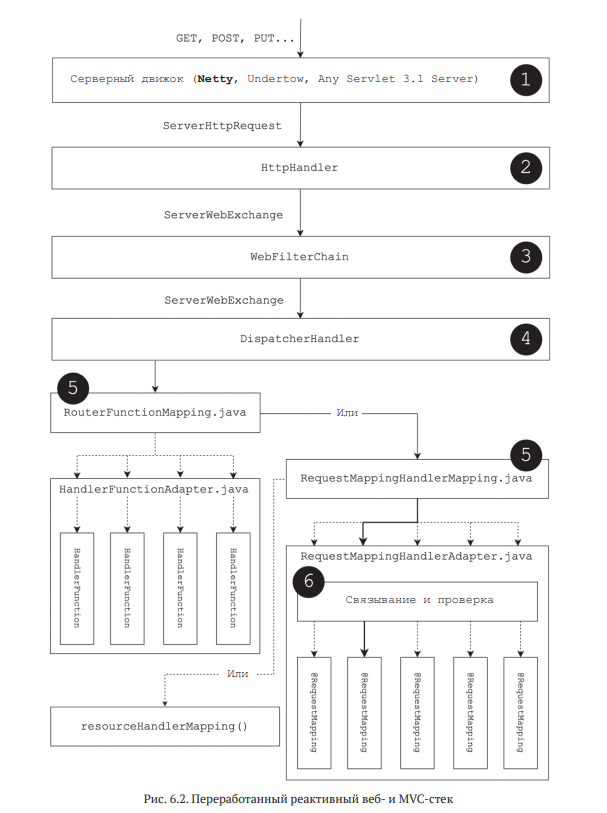
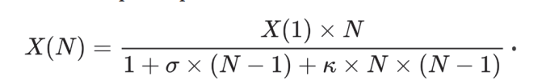
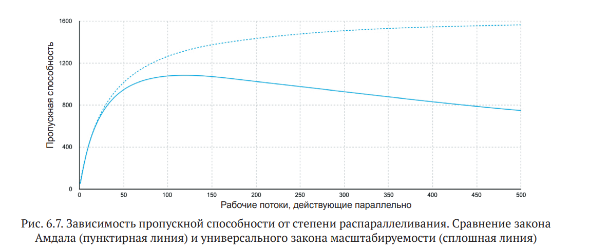

http://rxmarbles.com - ресурс с операторами в RxJava

Hystrix: библиотека для реализации отказоустойчивых служб (https://
github.com/Netflix/Hystrix);
• Ribbon: библиотека RPC с поддержкой балансировки нагрузки (https://
github.com/Netflix/ribbon);
• Zuul: защищенный и устойчивый шлюз, поддерживающий динамическую маршрутизацию и возможность
мониторинга (https://github.com/
Netflix/zuul);
• RxNetty: реактивный адаптер для Netty, клиент/серверного фреймворка
NIO (https://github.com/ReactiveX/RxNetty).

Чтобы приложение соответствовало принципам реактивного дизайна, мы не
можем использовать старую модель извлечения данных для получения информации.
К счастью, в настоящее время имеется несколько широко распространенных
протоколов для асинхронной передачи сообщений от сервера клиенту, а именно
WebSocket и Server-Sent Events (SSE).

Прежде всего Project Reactor предлагает две реализации интерфейса Publisher<T>:
Flux<T> и Mono<T>.
В отличие от Flux, тип Mono определяет поток данных, который может произвести
не более одного элемента и описывается следующей формулой

Во второй версии RxJava 2.X в библиотеке появились следующие реактивные типы: Observable,
Flowable, Single, Maybe и Completable. Давайте посмотрим, чем они отличаются
и чем похожи на тандем типов Flux/Mono.

Паттерны в реактивном программировании:
1. Iterator, Observer, Publisher/Subscriber

Библиотека поддерживает распространение обратного давления для всех возможных моделей:

[ 144 ]
• PUSH: подписчик запрашивает фактически бесконечное количество элементов
вызовом subscription.request(Long.MAX_VALUE);
• PULL: подписчик запрашивает следующий элемент только после обработки
предыдущего: subscription.request(1);
• PULL-PUSH (иногда эту модель называют смешанной):
подписчик управляет передачей элементов в режиме реального времени,
а издатель подстраивается под заявленную скорость потребления данных.

Кроме того, для адаптации под старый API,
не поддерживающий модель PULL-PUSH,
Reactor предлагает массу классических механизмов управления обратным
давлением, а именно кеширование, кадрирование,
удаление избыточных сообщений, возбуждение исключений и т. д.

Reactive Streams определяет всего четыре интерфейса: Publisher<T>, Subscriber<T>, Subscription и Processor<T, R>.

Всего
в библиотеке четыре оператора, позволяющих переключать рабочие потоки.
Рассмотрим их по очереди.
Оператор publishOn позволяет перенести этап выполнения потока данных
в конкретный рабочий поток.

Другим важным фактором поддержки многопоточного выполнения в Reactor является оператор subscribeOn.
В отличие от publishOn, оператор subscribeOn позволяет изменить рабочий поток выполнения,
в котором выполняется часть цепочки, относящаяся к подписке.

Кроме нетривиальных операторов для управления потоками выполнения, в которых должны протекать те или иные этапы
обработки данных, библиотека Reactor
предлагает уже знакомый способ распараллеливания работы. Для этого в Reactor
имеется оператор .parallel, который позволяет разбить один поток данных на
несколько подпотоков и распределить элементы между ними. Вот пример использования этого оператор

Планировщики
• SingleScheduler - один рабочий р поток
• ParallelScheduler - фиксированное кол-во р потоков
• ElasticScheduler - кэшированые неограниченный пулл потоков дла i/o

Контекст
Экземпляр Context
доступен через оператора Mono.subscriberContext и может добавляться в поток
данных с использованием оператора subscriberContext(Context).

Слияние операторов
Одно из самых заметных
усовершенствований – это жизненный цикл реактивного потока и слияние
операторов.

Макрослияние -
оптимизации, когда проджект реактор на этапе сборки потока обработки заменяет методы обработк на их отпимизированные
варианты.
Например Flux.just(1).publishOn().map() на subscribeOn()
Вообще, целью оптимизации макрослияния в Project Reactor является оптимизация этапа сборки, чтобы
дать возможность для стрельбы по воробьям вместо пушки использовать более
простое и дешевое оружие.

Микрослияние
икрослияние (micro-fusion) – более сложная оптимизация.
Она связана с оптимизацией этапа выполнения и повторным использованием ресурсов.
Flux.from(factory)
.filter(inspectionDepartment)
.subscribe(store);
ConditionalSubscriber. Он позволяет организовать проверку условия непосредственно на стороне источника и передачу
необходимого количества
элементов без дополнительных вызовов request.
Книга по спринг буту «Preview Online Code Files Learning Spring Boot 2.0, Second Edition», где очень
подробно исследуется Spring Boot.

Архитектура реактивного веб-стека

Важный вопрос – как число параллельно выполняющихся рабочих потоков влияет на задержку или пропускную
способность?

Чтобы объяснить такое поведение системы, универсальный закон масштабируемости (Universal Scalability Law, USL),
дополняющий закон Амдала, предлагает следующую формулу для вычисления изменения пропускной способности
в зависимости от степени распараллеливания:

В предыдущей формуле появился новый коэффициент – коэффициент согласования (k). Самое примечательное, что согласно
этому закону пропускная способность X(N) находится в обратной квадратичной зависимости от степени распараллеливания N.

Чтобы обеспечить соответствующую нагрузку на промежуточное ПО и собрать
статистику измерений, используем современный инструмент тестирования производительности –
wrk (https://github.com/wg/wrk).

МИНУСЫ РАСПРЕДЕЛЁННЫЪ ТРАНЗАКЦИЙ

Однако в настоящее время не рекомендуется прибегать к распределенным транзакциям между несколькими микросервисами. Это
обусловлено несколькими причинами. Наиболее важные перечислены ниже:
• служба, поддерживающая распределенные транзакции, должна иметь API
двухфазного подтверждения, реализовать который очень непросто;
• микросервисы, вовлекаемые в распределенную транзакцию, оказываются
чересчур тесно связанными, что явно противоречит идее архитектуры на
основе микросервисов;
• распределенные транзакции не масштабируются, ограничивают пропускную способность системы и соответственно ухудшают
масштабируемость
системы.

СОБЫТИЙНО_ОРИЕНТИРОВАННЫЕ АРХИТЕКТУРЫ
Лучший способ реализовать поддержку распределенных бизнес-транзакций
в окружении микросервисов – создать событийно-ориентированную архитектуру, которую мы уже несколько раз рассматривали в
этой книге.
Если требуется изменить состояние системы, первая служба изменяет свои данные в своей базе данных и в рамках той же
самой внутренней транзакции посылает событие брокеру сообщений. То есть транзакции не пересекают границ службы. Вторая
служба, подписавшаяся на требуемый тип событий, получает события
и изменяет соответственно данные в своем хранилище и, возможно, посылает
свое событие. Службы остаются независимыми друг от друга. Единственное, что
их связывает, – это сообщения, которыми они обмениваются. В отличие от распределенных транзакций,
событийно-ориентированная архитектура позволяет
системе нормально действовать, даже если вторая служба не будет работать, когда первая выполнит действие. Это очень
важная характеристика, потому что она
напрямую влияет на устойчивость системы. Распределенная транзакция требует,
чтобы все вовлеченные компоненты (микросервисы) были доступны и исправно работали, пока она протекает. Чем больше
микросервисов в системе или чем
шире вовлеченность их в распределенные транзакции, тем сложнее такой системе действовать.

<h1>Согласованность в конечном счете</h1>
Давайте оглянемся назад и  посмотрим, какую роль играют распределенные
транзакции в  программной системе. Очевидно, что главная их цель – обеспечить пребывание системы в некотором определенном состоянии. Иначе говоря,
они устраняют неопределенность, которая может быть вызвана несовместимостью состояний разных компонентов системы. Однако такое устранение неопределенности является очень ограничительным требованием. Вон Вернон (Vaughn
Vernon), автор книги «Implementing Domain-Driven Design and Domain-Driven Design
Distilled»5, предложил внедрить неопределенность в  предметную модель. По его
словам, если систему сложно защитить от противоречивого состояния, которое все
равно возникает, сколько бы мы с ним ни боролись, выгоднее будет принять неопределенность и сделать ее частью обычного бизнес-процесса.
Например, наша система могла бы создавать заказ без подтверждения платежа,
вводя новое состояние с названием проверка платежной информации. Это новое событие превращает неопределенное состояние (информация о платеже может подтвердиться или не подтвердиться) в отдельный бизнес-этап, требующий
некоторого времени для завершения (пока информация о платеже не подтвердится). С таким подходом мы не требуем, чтобы система постоянно находилась
в непротиворечивом состоянии. Мы лишь хотим, чтобы система имела непротиворечивое представление о  каждой бизнес-транзакции. Такая непротиворечивость в будущем называется согласованностью в конечном счете. Суть ее иллюстрирует диаграмма на рис. 7.9.

<h1>Шаблон SAGA</h1>
Один из самых популярных шаблонов для реализации распределенных транзакций, особенно в мире микросервисов, называется SAGA (сага). Он был придуман
в 1987 году для управления долгоживущими транзакциями в базах данных.
Сага состоит из нескольких мелких транзакций, каждая из которых является локальной для своего микросервиса. В  этом случае внешний запрос инициирует
сагу и запускает первую небольшую транзакцию, которая при успешном завершении запускает вторую транзакцию и т.д. Если какая-то транзакция в середине терпит неудачу, запускается действие, компенсирующее предыдущие транзакции. Существует два основных способа реализации шаблона  – посредством
регистрации событий и обращением к службе-координатору

<h1>Разделение ответственности на команды и запросы</h1>
Разделение ответственности на команды и запросы (Command Query Responsibility Segregation, CQRS) часто используется в  паре с  регистрацией событий.
Шаблон CQRS состоит из двух частей:
• пишущая часть получает команды изменения состояния и  сохраняет их
в базовом хранилище событий, но не возвращает состояния сущности;
• читающая часть не изменяет состояния сущности и возвращает его в ответ на запросы. Представления состояний для отдельных запросов хранятся отдельно и пересчитываются асинхронно после получения изменяющих 
событий

<h1>Бесконфликтно реплицируемые типы данных</h1>
Чем больше становится наше приложение, тем больше данных оно должно обрабатывать, даже если имеет единственный микросервис с четко ограниченной
областью. Как упоминалось выше, транзакции не поддаются масштабированию,
и  с ростом приложения становится все труднее поддерживать глобальную целостность состояния даже в рамках одного микросервиса. Поэтому для лучшей
производительности и  масштабируемости системы мы можем разрешить конкурентное изменение данных разными экземплярами службы, отказавшись от
глобальной блокировки или согласования транзакций. Такой подход называется оптимистической репликацией и  позволяет репликам данных развиваться параллельно с возможными несоответствиями, которые должны быть улаже
ны позже. В таких сценариях несогласованность между репликами устраняется
на этапе их слияния. В  этот момент все конфликты между ними должны быть
ликвидированы, но иногда для этого требуется отменить некоторые изменения,
что может быть неприемлемо с точки зрения пользователя. Однако существуют
такие структуры данных, обладающие особыми математическими свойствами,
которые гарантируют успех слияния реплик. Подобные структуры называются
бесконфликтно реплицируемыми типами данных (Conflict-Free Replicated
Data Types, CRDT).  
CRDT – это типы данных, которые могут реплицироваться по нескольким вычислительным единицам, изменяться конкурентно без всякой координации и затем
объединяться для приведения в целостное, непротиворечивое состояние. Эта идея
была описана в 2011 году Марком Шапиро (Marc Shapiro), Нуно Прегуиком (Nuno
Preguica), Мареком Завирски (Marek Zawirski) и Карлосом Бакеро (Carlos Baquero).
На момент написания этих строк к CRDT относилось несколько типов данных, таких как «только растущий счетчик», «только расширяющееся множество», «двухфазное множество» Two-Phase Set, «множество – последний записанный побеждает» и  некоторые другие множества, которые могут удовлетворить лишь час
бизнес-требований. Однако типы CRDT полезны для сценариев совместного редактирования текста, онлайн-чатов и азартных онлайн-игр. SoundCloud, платформа распространения звукозаписей, использует CRDT и веб-фреймворк Phoenix для
поддержки обмена информацией между множеством узлов в  режиме реального
времени, а Microsoft Cosmos DB использует CRDT для записи данных. База данных
Redis также имеет встроенную поддержку CRDT в форме бесконфликтно реплицируемой базы данных (Conflict-Free Replicated Database, CRDB).