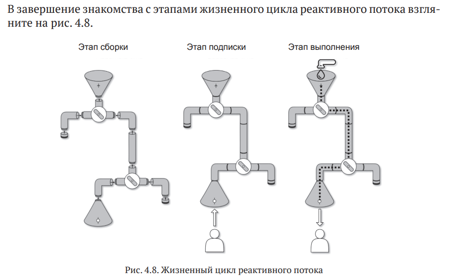
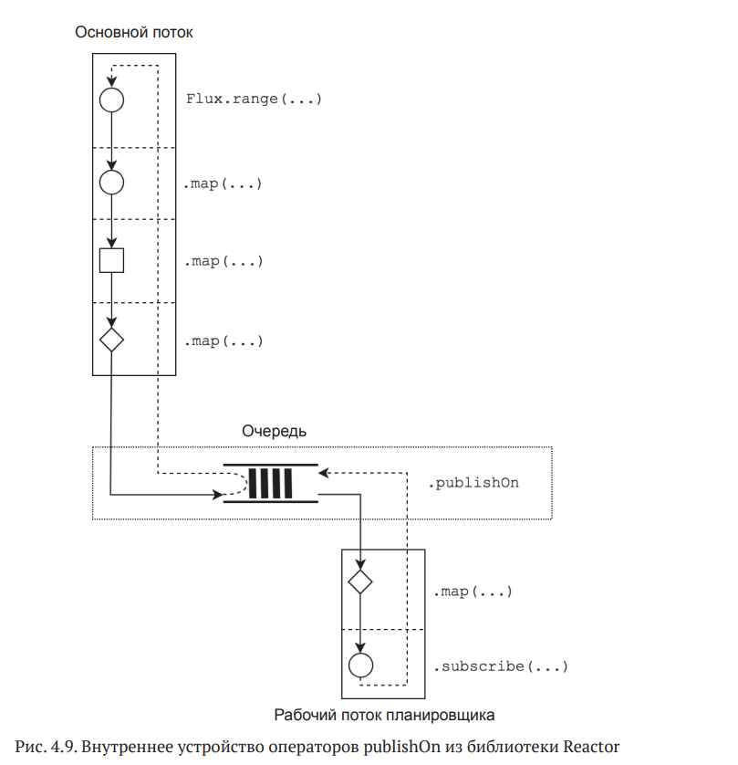
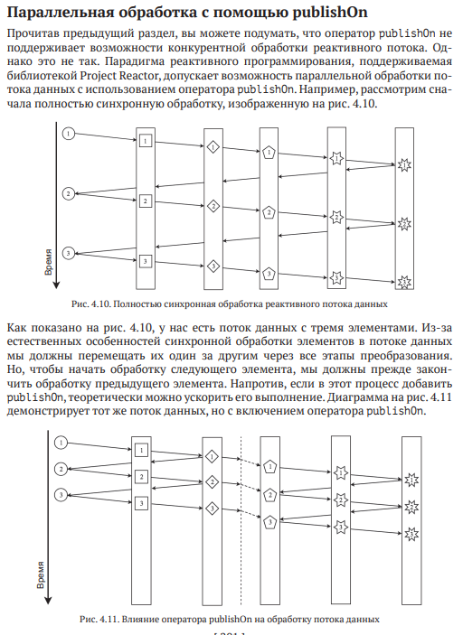
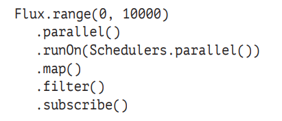

http://rxmarbles.com - ресурс с операторами в RxJava

Hystrix: библиотека для реализации отказоустойчивых служб (https://
github.com/Netflix/Hystrix);
• Ribbon: библиотека RPC с поддержкой балансировки нагрузки (https://
github.com/Netflix/ribbon);
• Zuul: защищенный и устойчивый шлюз, поддерживающий динамическую маршрутизацию и возможность мониторинга (https://github.com/
Netflix/zuul);
• RxNetty: реактивный адаптер для Netty, клиент/серверного фреймворка
NIO (https://github.com/ReactiveX/RxNetty).

Чтобы приложение соответствовало принципам реактивного дизайна, мы не
можем использовать старую модель извлечения данных для получения информации. 
К счастью, в настоящее время имеется несколько широко распространенных
протоколов для асинхронной передачи сообщений от сервера клиенту, а именно
WebSocket и Server-Sent Events (SSE).

Прежде всего Project Reactor предлагает две реализации интерфейса Publisher<T>:
Flux<T> и Mono<T>.
В отличие от Flux, тип Mono определяет поток данных, который может произвести
не более одного элемента и описывается следующей формулой

Во второй версии RxJava 2.X в библиотеке появились следующие реактивные типы: Observable,
Flowable, Single, Maybe и Completable. Давайте посмотрим, чем они отличаются
и чем похожи на тандем типов Flux/Mono.

Паттерны в реактивном программировании:
    1. Iterator, Observer, Publisher/Subscriber

Библиотека поддерживает распространение обратного давления для всех возможных моделей:

[ 144 ]
• PUSH: подписчик запрашивает фактически бесконечное количество элементов 
вызовом subscription.request(Long.MAX_VALUE);
• PULL: подписчик запрашивает следующий элемент только после обработки
предыдущего: subscription.request(1);
• PULL-PUSH (иногда эту модель называют смешанной): 
подписчик управляет передачей элементов в режиме реального времени, 
а издатель подстраивается под заявленную скорость потребления данных.

Кроме того, для адаптации под старый API, 
не поддерживающий модель PULL-PUSH, 
Reactor предлагает массу классических механизмов управления обратным
давлением, а именно кеширование, кадрирование, 
удаление избыточных сообщений, возбуждение исключений и т. д.

Reactive Streams определяет всего четыре интерфейса: Publisher<T>, Subscriber<T>, Subscription и Processor<T, R>.

Всего
в библиотеке четыре оператора, позволяющих переключать рабочие потоки.
Рассмотрим их по очереди.
Оператор publishOn позволяет перенести этап выполнения потока данных
в конкретный рабочий поток.

Другим важным фактором поддержки многопоточного выполнения в Reactor является оператор subscribeOn. 
В отличие от publishOn, оператор subscribeOn позволяет изменить рабочий поток выполнения, 
в котором выполняется часть цепочки, относящаяся к подписке.

Кроме нетривиальных операторов для управления потоками выполнения, в которых должны протекать те или иные этапы обработки данных, библиотека Reactor
предлагает уже знакомый способ распараллеливания работы. Для этого в Reactor
имеется оператор .parallel, который позволяет разбить один поток данных на
несколько подпотоков и  распределить элементы между ними. Вот пример использования этого оператор

Планировщики
• SingleScheduler - один рабочий р поток
• ParallelScheduler - фиксированное кол-во р потоков
• ElasticScheduler - кэшированые неограниченный пулл потоков дла i/o

Контекст
Экземпляр Context
доступен через оператора Mono.subscriberContext и  может добавляться в  поток
данных с использованием оператора subscriberContext(Context).

Слияние операторов
Одно из самых заметных
усовершенствований – это жизненный цикл реактивного потока и  слияние
операторов. 

Макрослияние - 
оптимизации, когда проджект реактор на этапе сборки потока обработки заменяет методы обработк на их отпимизированные варианты.
Например Flux.just(1).publishOn().map() на subscribeOn()
Вообще, целью оптимизации макрослияния в Project Reactor является оптимизация этапа сборки, чтобы
дать возможность для стрельбы по воробьям вместо пушки использовать более
простое и дешевое оружие.

Микрослияние
икрослияние (micro-fusion) – более сложная оптимизация. 
Она связана с оптимизацией этапа выполнения и повторным использованием ресурсов.
Flux.from(factory)
.filter(inspectionDepartment)
.subscribe(store);
ConditionalSubscriber. Он позволяет организовать проверку условия непосредственно на стороне источника и передачу необходимого количества
элементов без дополнительных вызовов request.
Книга по спринг буту «Preview Online Code Files Learning Spring Boot 2.0, Second Edition», где очень
подробно исследуется Spring Boot.